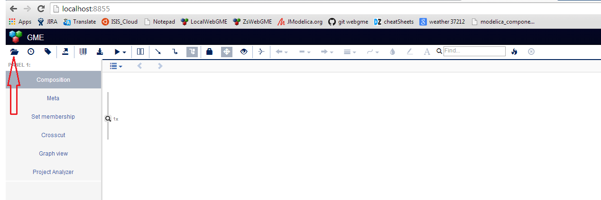
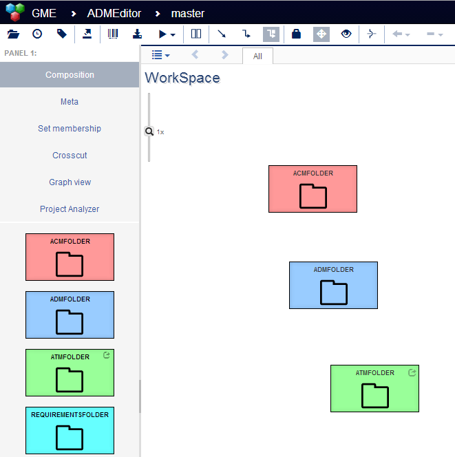
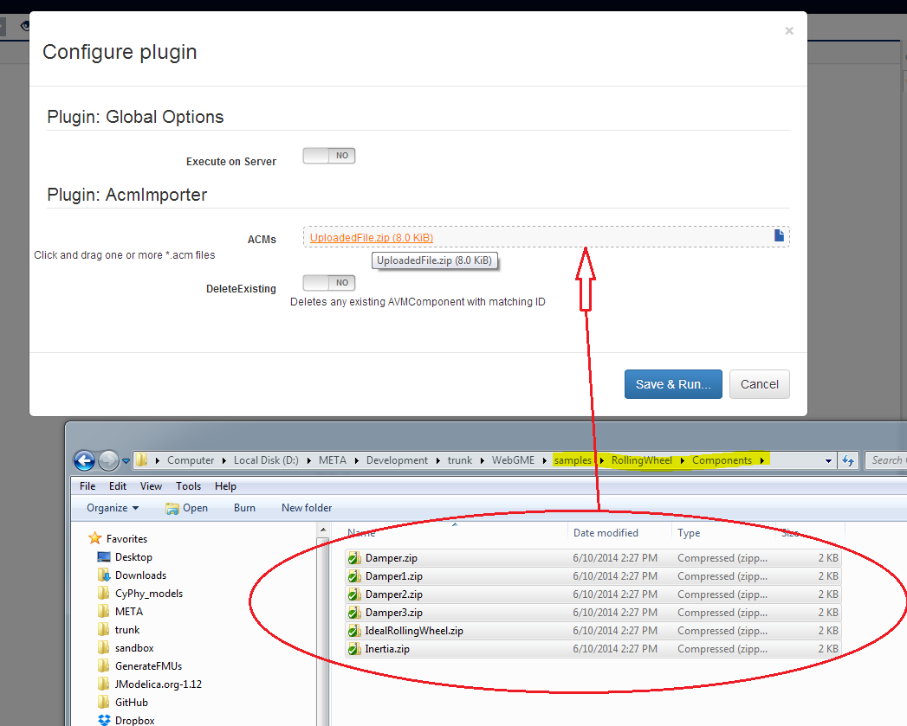

% CyPhy-WebGME manual
% Dynamics Team
% May 29, 2014

# Installing and Serving Application #
## Dependencies ##
### NodeJS ###
Download nodejs from http://nodejs.org/download/. If you have 64-bit version of windows select the 64-bit version. During installation make sure that all options are selected. (The provided batch-files assumes that node and npm are avaliable.)

### MongoDB ###
Download mongodb from http://www.mongodb.org/downloads. If you have 64-bit version of windows select the 64-bit version. The provided batch-files assumes it is installed at `C:\Program Files\MongoDB 2.6 Standard`. (Choosing typical installation and on the 64-bit version will put it there.)

## Installation ##
Make any necessary modifications to `install_script.cmd` and run it. It will log the progress in `install.log`.

## Serving a WebGME application ##
Start the data-base by running `launch_database.cmd` (`install_script.cmd` will also leave the data-base running). Proceed with running `launch_app.cmd`. While serving, leave both applications running and visit localhost:8855 in a browser.

# Starting a new ADMEditor Project #
From [localhost:8855](localhost:8855), click the folder icon in the left most corner of the tool-bar.

In the first dialog select `Create from file...`. Name the new project `ADMEditor` (case sensitive!) and click `Import file...`. and select `webgme-cyphy\meta\ADMEditor_metaOnly.json` which contains the META-model for the ADMEditor-Language and an empty project structure.

The root-node should show up and if you expand it and click on the ADMEditorModelingLanguage will show up on the canvas. This contains the object types which are available in this language.

# Working with an ADMEditor Project #
In the Projects/NewProject create a new ACMFolder, ADMFolder and ATMFolder.

## Working with ACMs ##

Open up the Folder and click the play-button drop down menu in the tool-bar. This will display the plugins (interpreters) that exist for the ADMEditor project. Run the AcmImporter.

In the dialog drag and drop the ACMs from `/samples/RollingWheel` as shown in the figure.

## Working with ADMs ##
Open the ADMFolder and run the AdmImporter. Either drag and drop or browse for the `/samples/RollingWheel/Wheel.adm` file and run the importer.

You now have a design that you can edit inside WebGME. As long as you keep the interfaces in the root container intact you will be able to execute it from a test-bench too. Apart from that, you can add new components, add/modify parameters, create subsystems etc.

## Working with ATMs ##
Create a new AVMTestBenchModel inside the folder. Open it up and set the `ID` to `/TestBenches/SinusInput` and choose a name. Drag and drop the `/samples/RollingWheel/tbAsset.zip` on the the attribute `TestBenchFiles`. Currently there is no editing support for test-benches inside WebGME. Instead you need to provide the test-bench as an xme together with the related files (e.g. post-processing scripts). You can unzip `tbAsset.zip` manually to get an idea of how it looks.

Drag and drop the Wheel container from the project-tree onto the test-bench and select make copy (instances have limited support at the moment).

Run the TestBenchRunner-plugin using the play button. As a first run, do not execute the test-bench. When it has finished you can look at the plugin-result and expand it. You should be provided with links to the generated artifacts. You can run the cmd-file on your machine, provided it has the META-tools installed.

Now run the plugin again and this time choose "Run Test-bench". This will take up to a couple of minutes. Once the the plugin has finished you can select thh `Project Analyzer` view in the Panel to the left. 

